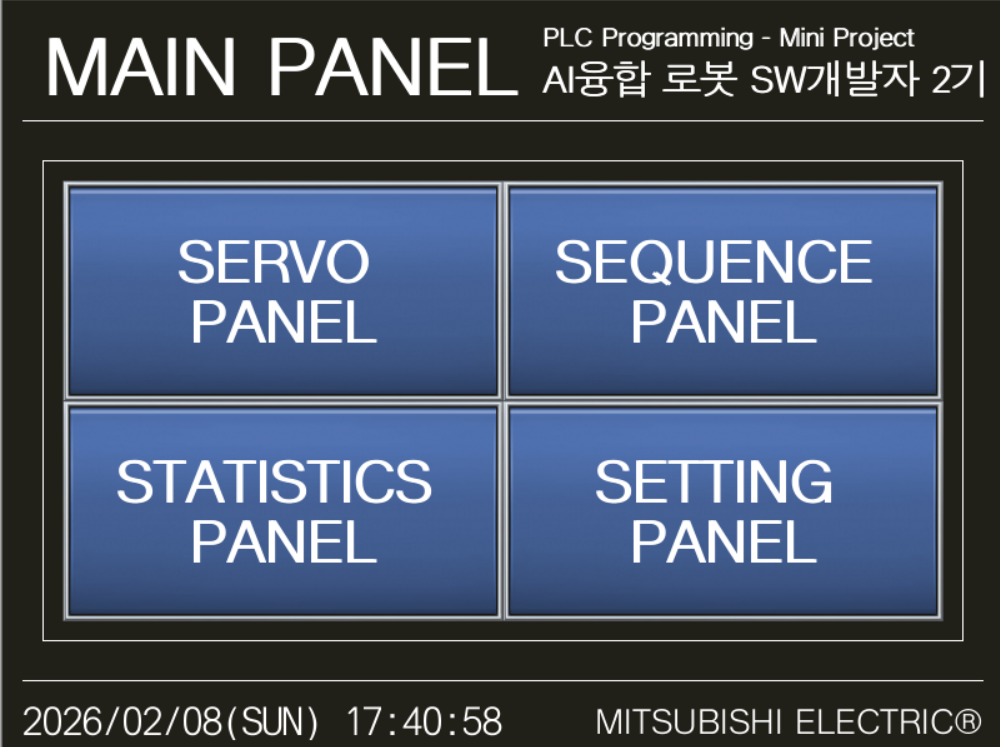
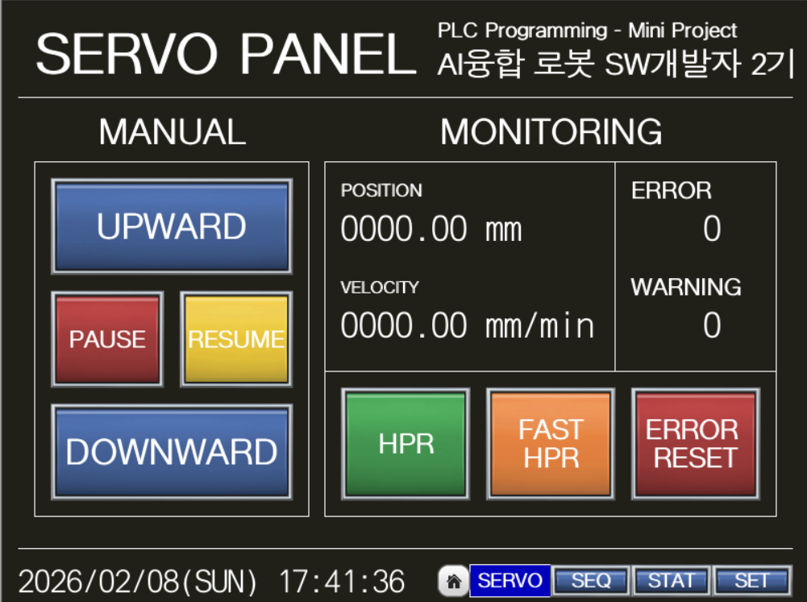
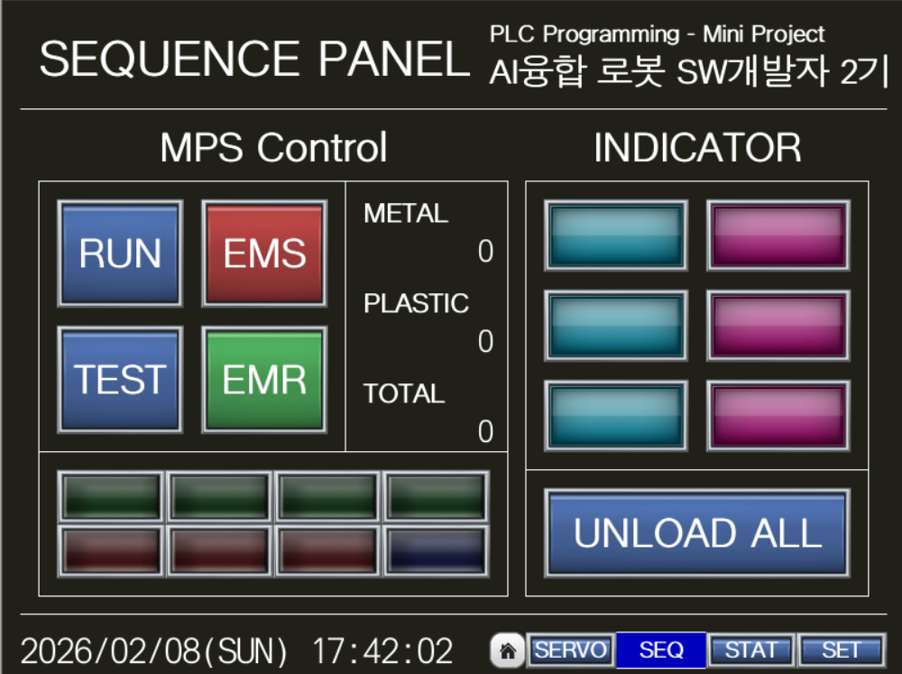
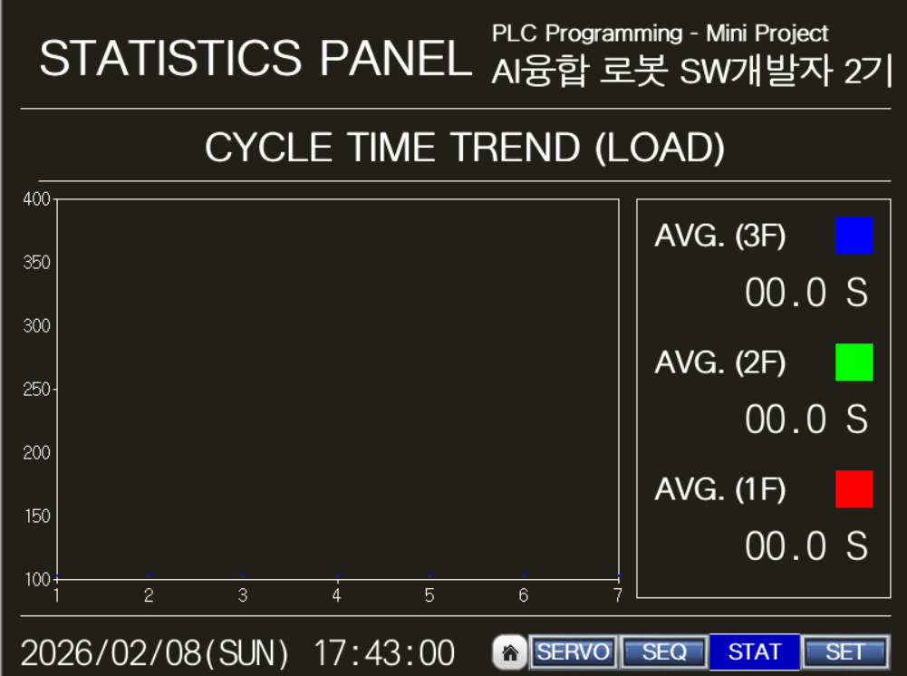

# PLC-Programming
대한상공회의소 서울기술교육센터  
AI융합 로봇 SW개발자 2기생 최민석  
PLC 프로그래밍 수업 미니 프로젝트

## 프로젝트 목표
PLC와 MPS 훈련 장비를 사용한 지능형 소재 가공/분류/적재/하역 시스템을 구축한다.  
기본 동작과 응용 동작, 그리고 HMI 작화를 포함해 하나의 시스템으로 통합한다.  

## 핵심 기능
- 기본 동작 구현
  - 소재 가공 및 분별 적재
  - 순차적 장비 점검
- 응용 동작 구현
  - 소재 선입선출(FIFO) 적재
  - 소재 개별 하역 및 일괄 하역

## UNLOAD 알고리즘
### 소재 개별 하역
HMI의 Storage Indicator에서 적재된 창고를 누르면 해당 소재만 선택적으로 하역한다.

### 알고리즘 동작 순서
1. HMI 시퀀스 제어 패널의 Storage Indicator에서 적재된 창고 버튼을 누르면 실행
2. 서보 모터가 해당 창고 위치로 이동
3. 흡착 실린더 전진 후 소재에 근접하도록 약간 하강
4. 하강 후 흡착 ON 후 0.5초 대기하여 흡착 효율 확보
5. 흡착 상태를 유지하며 서보 모터 상승
6. 해당 창고의 우선순위를 0으로 초기화
7. 흡착 실린더 후진 후 컨베이어 벨트 위로 이동
8. 컨베이어 벨트 위에서 하강 후 흡착 해제
9. 0.5초 대기 후 컨베이어 벨트를 가동해 저장 박스로 배출
10. 서보 모터 중간 대기 위치(PD #7)로 복귀

### 우선순위 관리
- 각 창고 칸마다 데이터 레지스터로 우선순위 관리
- 적재시 현재 총계값을 기반으로 우선순위 부여 (총계값 + 1)
- 따라서 각 창고의 우선순위는 모두 고유하며 중복이 없음
- 하역 완료시 해당 창고의 우선순위를 0으로 초기화해 빈 공간으로 표시

## FIFO 알고리즘
### 구현 개요
창고가 가득 찬 상태에서 새로운 소재가 투입되면, 가장 먼저 들어온 소재를 자동으로 하역하고 새로운 소재를 적재하는 선입선출(FIFO) 시스템이다.

### 알고리즘 동작 순서
1. 재질 판별 후, 해당 재질의 창고가 모두 차있는지 확인
2. 창고가 가득 찬 경우, 가장 작은 적재 순서 번호를 가진 소재를 탐색
3. 해당 소재를 창고에서 꺼내 컨베이어 벨트 위에 적재
4. 컨베이어 벨트를 가동해 하역한 소재를 버리고 새로운 소재 적재 준비
5. 비워진 공간에 새로운 소재 적재 후 우선순위 갱신 (작업 완료 총계 + 1)

## HMI 작화
### 화면 구성
1. 주 화면 (Main Panel)

   - 전원 인가시 초기 화면
   - 각 제어 화면으로 이동하는 스크린 스위칭 버튼 배치

2. 서보 제어 패널 (Servo Panel)

   - 서보 모터 제어 기능: JOG 운전, 원점 복귀, 고속 원점 복귀
   - 서보의 현재 위치와 속도를 0.01mm 단위로 실시간 모니터링 가능
   - 에러/경고 코드 표시 및 에러 발생시 리셋 가능

3. 시퀀스 제어 패널 (Sequence Panel)

   - MPS 제어 기능: **RUN**(공정 가동), **TEST**(순차적 장비 점검), **UNLOAD ALL** (일괄 하역)
   - **Storage Indicator**: 6개 창고의 적재 상태 시각화 및 개별 하역 기능 제공
   - 7개의 물리 램프와 부저를 HMI에서 시각적 피드백 제공
   - 재질별 작업 계수 및 총계 표시

6. 통계 패널 (Statistics Panel)

   - Cycle Time 그래프: 최근 7건의 층별 적재 시간 시각화 
   - 1층은 붉은색으로, 2층은 초록색으로, 3층은 하늘색으로 표시
   - 통계량 표시: 각 층별 평균 적재 수행 시간 표시

8. 설정 패널 (Setting Panel)

   - 가공 설정: 드릴 동작 횟수 및 시간을 조정 가능
   - 다국어 지원: 영어, 한국어, 일본어 전환 가능 

## 서보 모터 설정
### Parameters
- Pr.8: Speed limit value = 4000.00 mm/min
- Pr.31: JOG speed limit value = 1000.00 mm/min
- Pr.44: HPR direction = 1:Reverse Direction (Address Decrease Direction)
- Pr.46: HPR speed = 900.00 mm/min
- Pr.47: Creep speed = 90.00 mm/min

### ServoParameters
- **PA04**: *AOP1: Function selection A-1 = 2100

### Positioning Data (Axis #1)
| No. | Positioning Address | Command Speed | 용도 |
|-----|---------------------|---------------|------|
| 1 | 154000.0 μm (154.0 mm) | 300.00 mm/min | 소재 흡착 시 저속 하강 |
| 2 | 147000.0 μm (147.0 mm) | 2800.00 mm/min | 3층 위치로 고속 이동 |
| 3 | 82000.0 μm (82.0 mm) | 300.00 mm/min | 소재 흡착 시 저속 하강 |
| 4 | 75000.0 μm (75.0 mm) | 2800.00 mm/min | 2층 위치로 고속 이동 |
| 5 | 10000.0 μm (10.0 mm) | 300.00 mm/min | 소재 흡착 시 저속 하강 |
| 6 | 20000.0 μm (20.0 mm) | 2800.00 mm/min | 1층 위치로 고속 이동 |
| 7 | 100000.0 μm (100.0 mm) | 2800.00 mm/min | Tact Time 최적화를 위한 대기 위치 |

# Lab Environment
- MITSUBISHI ELECTRIC MELSEC-Q Series
  - PLC: **Q03UDVCPU**
  - Input module: **QX40** * 2 EA
  - Output module: **QY10** * 2 EA
  - Analog I/O module: Q64AD2DA
  - Network module: QJ61BT11N
  - Positioning module: **QD77MS2**
  - Servo Driver: **MR-J4-10B**
  - Servo Motor: **HG-KR13J**
  - HMI Device: **GOT2000**

- MITSUBISHI ELECTRIC MELSOFT Series
  - PLC Programming: **GX Works2** (1.631H)
  - HMI Design: **GT Designer3** (1.256S)
  - HMI Simulator: **GT Simulator3** (1.256S)

# MPS Training System Composition
- Pneumatics
  - Double solenoid pneumatic cylinder * 5 EA
  - Single solenoid pneumatic cylinder * 2 EA
  - Pressure regulator: AW20-01BG-A (for penumatic control)
  - Vacuum suction cup
- Motors
  - Training Drill Unit
  - Conveyor belt

## Memory Map
### Input
| Address | Description | Type |
|---------|-------------|------|
| X00 | 공급 실린더 후진완료 | Sensor |
| X01 | 공급 실린더 전진완료 | Sensor |
| X02 | 분배 실린더 후진완료 | Sensor |
| X03 | 분배 실린더 전진완료 | Sensor |
| X04 | 가공 실린더 상승완료 | Sensor |
| X05 | 가공 실린더 하강완료 | Sensor |
| X06 | 배출 실린더 후진완료 | Sensor |
| X07 | 배출 실린더 전진완료 | Sensor |
| X08 | 스토퍼 실린더 상승완료 | Sensor |
| X09 | 스토퍼 실린더 하강완료 | Sensor |
| X0a | 흡착 실린더 후진완료 | Sensor |
| X0b | 흡착 실린더 전진완료 | Sensor |
| X0d | 창고 실린더 전진완료 | Sensor |
| X0e | 창고 실린더 전진완료 | Sensor |
| X0f | 소재공급 센서1 (원형) | Sensor |
| X11 | 용량형 센서 | Sensor |
| X12 | 유도형 센서 | Sensor |
| X13 | 스토퍼 감지 센서 | Sensor |
| X15 | 작업 시작 버튼 (PB1) | Button |
| X16 | 장비 점검 버튼 (PB2) | Button |
| X17 | Push Button 3 | Button |
| X18 | Push Button 4 | Button |
| X19 | Push Button 5 | Button |
| X1a | Push Button 6 | Button |
| X1b | Push Button 7 | Button |
| X1c | Push Button 8 (Toggle) | Button |

### Output
| Address | Description | Type |
|---------|-------------|------|
| Y20 | 공급 실린더 전진 | Solenoid Valve |
| Y21 | 공급 실린더 후진 | Solenoid Valve |
| Y22 | 분배 실린더 전진 | Solenoid Valve |
| Y23 | 분배 실린더 후진 | Solenoid Valve |
| Y24 | 가공 실린더 전/후진 | Solenoid Valve |
| Y25 | 배출 실린더 전진 | Solenoid Valve |
| Y26 | 배출 실린더 후진 | Solenoid Valve |
| Y27 | 스토퍼 실린더 전/후진 | Solenoid Valve |
| Y28 | 흡착 실린더 전진 | Solenoid Valve |
| Y29 | 흡착 실린더 후진 | Solenoid Valve |
| Y2a | 흡착 모듈 ON/OFF | Solenoid Valve |
| Y2b | 창고 실린더 전진 | Solenoid Valve |
| Y2c | 창고 실린더 후진 | Solenoid Valve |
| Y2d | 드릴 모터 ON/OFF | Motor |
| Y2e | 컨베이어 모터 ON/OFF | Motor |
| Y30 | 물리 램프 1번 | Lamp | 
| Y31 | 물리 램프 2번 | Lamp |
| Y32 | 물리 램프 3번 | Lamp | 
| Y33 | 물리 램프 4번 | Lamp |
| Y34 | 물리 램프 5번 | Lamp | 
| Y35 | 물리 램프 6번 | Lamp |
| Y36 | 물리 램프 7번 | Lamp | 
| Y37 | 부저 | Buzzer |

### Internal Relay
| Device | Range | Description |
|--------|-------|-------------|
| M0~M399 | MAIN | 소재 가공, 창고 적재, FIFO 구현 |
| M400~M599 | TEST | 순차적 장비 점검 |
| M600~M799 | UNLOAD1 | 소재 개별 하역 |
| M800~M999 | UNLOAD2 | 소재 일괄 하역 |
| M1000~M1199 | SERVO | 서보 모터 제어 |
| M4000~M4199 | Indicator | 창고 적재 상태 (HMI용 가상 램프) |
| M6000~M6199 | INIT | 시스템 변수 초기화 및 POR |

### Data Register
| Device | Description | Unit |
|--------|-------------|------|
| D11~D16 | 창고 1~6번 우선순위 값 | - |
| D50 | 서보 위치 저장 | - |
| D100, D102 | 포지셔닝 데이터 번호 | - |
| D1001~D1004 | 서보 현재 위치 | 0.01mm |
| D1005~D1008 | 서보 현재 속도 | 0.01mm/min |
| D2000 | 가공 모터 반복 횟수 | 회 (1~5) |
| D2001 | 가공 모터 대기 시간 | 0.1초 (5~20) |
| D3000~D3002 | 금속/비금속 입력 개수 및 총계 | EA |
| D3110~D3136 | 층별 Cycle Time 데이터 (최근 7건) | ms |
| D3200~D3236 | Cycle Time 통계 (합산, 평균) | ms |
| D9999 | 언어 설정 (0:EN, 1:KR, 2:JP) | - |
